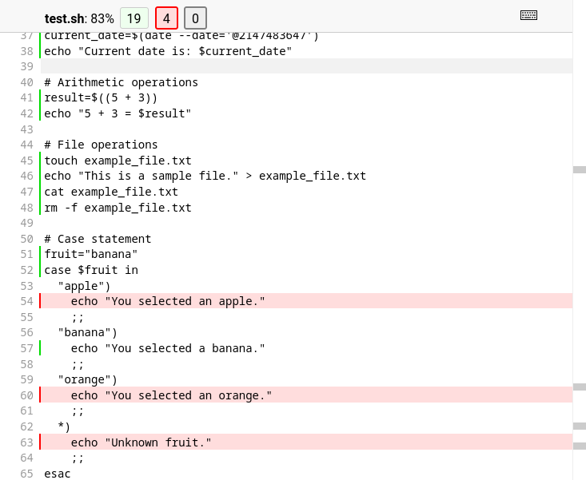

# Coverage.sh

[](https://pypi.org/project/coverage-sh/)
[](https://github.com/lackhove/coverage-sh/blob/main/pyproject.toml)
[](https://github.com/lackhove/coverage-sh/blob/main/pyproject.toml)
[](https://github.com/lackhove/coverage-sh/blob/main/LICENSE.txt)
[](https://github.com/astral-sh/ruff)
[](https://rye-up.com)

A  [Coverage.py](https://github.com/nedbat/coveragepy) plugin to measure code coverage of shell (sh or bash) scripts
executed from python.

## Installation

```shell
pip install coverage-sh
```

## Usage

In your `pyproject.toml`, set

```toml
[tool.coverage.run]
plugins = ["coverage_sh"]
```

and run

```shell
coverage run main.py
coverage combine
coverage html
```

to measure coverage of all shell scripts executed via
the [subprocess](https://docs.python.org/3/library/subprocess.html) module, e.g.:

```python
subprocess.run(["bash", "test.sh"])
```

The resulting coverage is then displayed alongside the coverage of the python files:



## Caveats

The plugin works by patching the `subprocess.Popen` class to set the "ENV" and "BASH_ENV" environment variables before
execution to source a helper script which enables tracing. This approach comes with a few caveats:

- It will only cover shell scripts that are executed via the subprocess module.
- Only bash and sh are supported

## License

Licensed under the [MIT License](LICENSE.txt).
